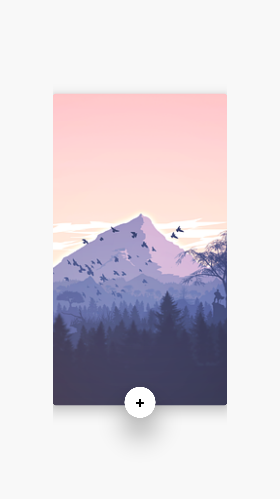
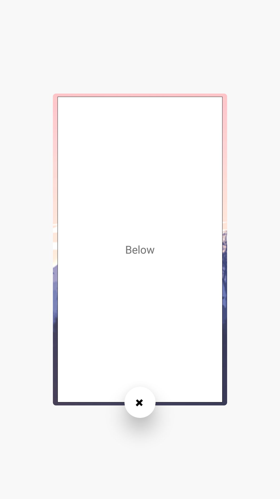

# CardFlipAnimation
This is an implementation of card Flip animation in android

<div>



</div>

<br/>
<h3>Dependencies</h3>

add the following dependency in your ```build.gradle (Module:app)``` file

```
  implementation 'androidx.cardview:cardview:1.0.0'
```

***UI part***
```xml
<?xml version="1.0" encoding="utf-8"?>
<androidx.constraintlayout.widget.ConstraintLayout
    xmlns:android="http://schemas.android.com/apk/res/android"
    xmlns:app="http://schemas.android.com/apk/res-auto"
    xmlns:tools="http://schemas.android.com/tools"
    android:layout_width="match_parent"
    android:layout_height="match_parent"
    android:paddingStart="68dp"
    android:paddingEnd="68dp"
    tools:context=".MainActivity">


<!--    Below layout-->
    <LinearLayout
        android:id="@+id/belowLayout"
        android:layout_width="match_parent"
        android:layout_height="392dp"
        android:layout_margin="6dp"
        android:gravity="center"
        android:background="@drawable/bgbelow"
        app:layout_constraintBottom_toBottomOf="parent"
        app:layout_constraintEnd_toEndOf="parent"
        app:layout_constraintStart_toStartOf="parent"
        app:layout_constraintTop_toTopOf="parent">

        <TextView
            android:layout_width="wrap_content"
            android:layout_height="wrap_content"
            android:text="Below" />

    </LinearLayout>

<!--    above layout-->
    <androidx.cardview.widget.CardView
        android:id="@+id/aboveLayout"
        app:cardElevation="12dp"
        app:cardCornerRadius="4dp"
        android:layout_width="match_parent"
        android:layout_height="wrap_content"
        app:layout_constraintBottom_toBottomOf="parent"
        app:layout_constraintEnd_toEndOf="parent"
        app:layout_constraintStart_toStartOf="parent"
        app:layout_constraintTop_toTopOf="parent">

        <ImageView
            android:src="@drawable/mountains"
            android:scaleType="centerCrop"
            android:layout_width="match_parent"
            android:layout_height="400dp"/>

    </androidx.cardview.widget.CardView>

<!--    toggle button-->
    <androidx.cardview.widget.CardView
        android:id="@+id/btn"
        android:layout_width="wrap_content"
        android:layout_height="wrap_content"
        android:layout_margin="4dp"
        android:minWidth="40dp"
        android:minHeight="40dp"
        app:cardCornerRadius="20dp"
        app:cardElevation="16dp"
        app:layout_constraintBottom_toBottomOf="@+id/aboveLayout"
        app:layout_constraintEnd_toEndOf="parent"
        app:layout_constraintStart_toStartOf="parent"
        app:layout_constraintTop_toBottomOf="@+id/aboveLayout">

        <TextView
            android:layout_width="wrap_content"
            android:layout_height="wrap_content"
            android:layout_gravity="center"
            android:text="+"
            android:textColor="@android:color/black"
            android:textSize="20sp"
            android:textStyle="bold" />

    </androidx.cardview.widget.CardView>


</androidx.constraintlayout.widget.ConstraintLayout>

```


***get height of the view***

```java
aboveLayout.getViewTreeObserver().addOnGlobalLayoutListener(new ViewTreeObserver.OnGlobalLayoutListener() {
            @Override
            public void onGlobalLayout() {
                //fetch height
                height=(aboveLayout.getHeight())/2;
            }
        });
        
```

***Animate on button click***
```java
btn.setOnClickListener(new View.OnClickListener() {
            @Override
            public void onClick(View v) {

                btn.animate().setInterpolator(interpolator).translationY(50).start();

                aboveLayout.animate().setDuration(duration).setInterpolator(interpolator).translationY(height).start();
                belowLayout.animate().setDuration(duration).setInterpolator(interpolator).translationY(-1*height)
                        .withEndAction(new Runnable() {
                            @Override
                            public void run() {

                                if(!isFlipped) {
                                    aboveLayout.setTranslationZ(-50);
                                    belowLayout.setTranslationZ(0);
                                    btn.animate().setInterpolator(interpolator).rotation(45).start();
                                }else {
                                    aboveLayout.setTranslationZ(0);
                                    belowLayout.setTranslationZ(-50);
                                    btn.animate().setInterpolator(interpolator).rotation(0).start();
                                }

                                aboveLayout.animate().setDuration(duration).setInterpolator(interpolator).translationY(0).start();
                                belowLayout.animate().setDuration(duration).setInterpolator(interpolator).translationY(0).start();
                                btn.animate().setInterpolator(interpolator).translationY(0).start();


                                isFlipped=!isFlipped;
                            }
                        })
                        .start();
            }
        });
```

```java

if(!isFlipped) {
                                    aboveLayout.setTranslationZ(-50);
                                    belowLayout.setTranslationZ(0);
                                    btn.animate().setInterpolator(interpolator).rotation(45).start();
                                }else {
                                    aboveLayout.setTranslationZ(0);
                                    belowLayout.setTranslationZ(-50);
                                    btn.animate().setInterpolator(interpolator).rotation(0).start();
                                }

```

once the button is clicked (`!isFlipped` will be `true`),the above layout(image) will go down (`aboveLayout.setTranslationZ(-50)`) and below layout will come up (`belowLayout.setTranslationZ(0)`),and when we click the button again (`!isFlipped` will be `false`),so reverse animation happens


***Dont forget to change value of `isFlipped`***
```java
isFlipped = !isFlipped
```
